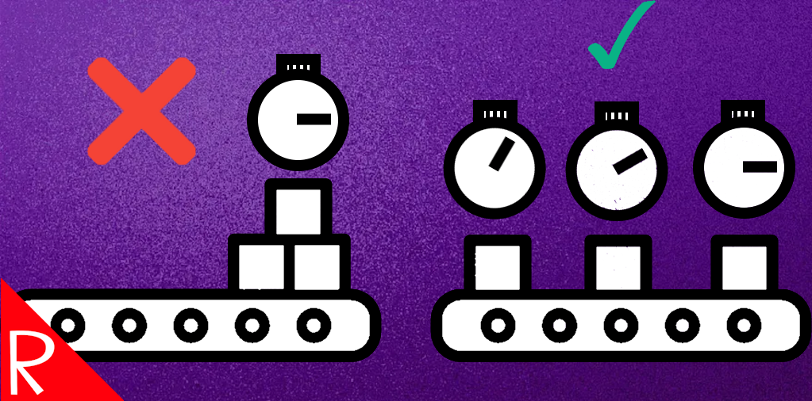

# Quasimorph Produce As Ready

  
This mod changes how production completion works. Instead of delivering all items from an order at once when production finishes, items are now added to your inventory individually as they are completed.

**Key benefits:**  
- No need to queue single items to receive them faster.
- Items become available as soon as each one is finished.

**Example:**  
In the base game, queuing 5 armor boxes (each taking 20 hours) results in all 5 boxes being delivered after 100 hours. With this mod, one armor box is added to your inventory every 20 hours, so you receive items as they are produced.

Additionally, this mod fixes a minor bug where production time could be lost under certain conditions.

# Buy Me a Coffee
If you enjoy my mods and want to buy me a coffee, check out my [Ko-Fi](https://ko-fi.com/nbkredspy71915) page.
Thanks!

# Source Code
Source code is available on GitHub at https://github.com/NBKRedSpy/ProduceAsReady

# Credits
[Production icons created by xnimrodx - Flaticon](https://www.flaticon.com/free-icons/production)
[Validate icons created by meaicon - Flaticon](https://www.flaticon.com/free-icons/validate)
[Close icons created by Pixel perfect - Flaticon](https://www.flaticon.com/free-icons/close)

# Change Log
## 1.1.1
* Multiple version support

## 1.1.0
* 0.9.6 compatibility
